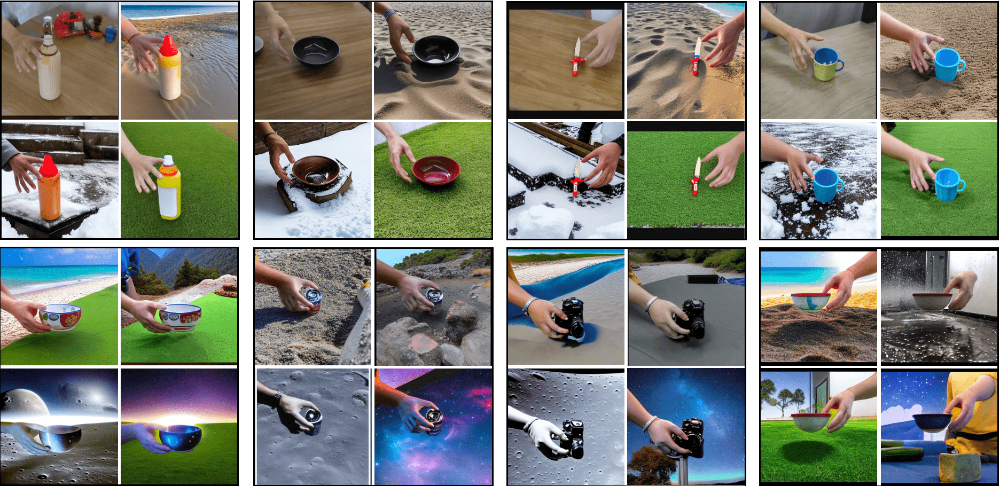

<h1> HOIDiffusion</h1>

Official implementation of HOIDiffusion: Generating Realistic 3D Hand-Object Interaction Data. 

[CVPR'24] | 📝 <a href="https://arxiv.org/abs/2403.12011">Arxiv</a> | 🗒️ <a href="https://mq-zhang1.github.io/HOIDiffusion/">Project Page</a> | 📽️ <a href="https://www.youtube.com/watch?v=YD_buFwMX44">Video</a> |✨ <a href="https://drive.google.com/drive/folders/1uAerYKpe3kVe1ypr3hTLwvjeBCbX1RqN?usp=sharing">Models</a>

# Easy to Install and Run
Ensure that your CUDA version is set to 11.7.
~/.bashrc
```
export PATH=/usr/local/cuda-11.7/bin:$PATH
export LD_LIBRARY_PATH=/usr/local/cuda-11.7/lib64:$LD_LIBRARY_PATH
```

### 1. Clone
```
git clone https://github.com/JunukCha/HOIDiffusion.git
cd HOIDiffsion
```

### 2. Install
```
source scripts/install.sh
```

### 3. Download GRAB Trained Networks
<a href="https://grab.is.tue.mpg.de/download.php">GRAB</a>

Sign in and find `Trained Networks` in the download menu. Download `models.zip` in `third_party/test` folder.

### 4. Extract and Move GRAB Trained Networks
```
source scripts/extract_mv_grabnet_pth.sh
```

### 5. Download GRAB object meshes
<a href="https://grab.is.tue.mpg.de/download.php">GRAB</a>


Download GRAB Objects and upzip it.

Put the folder `contact_meshes` in the `/data/GRAB/tools/object_meshes`. Or put the folder `contact_meshes` in the other folder and edit the `--obj-path` in [this file](https://github.com/JunukCha/HOIDiffusion/blob/f159a5236009a971c7f7b3477a6aa86a69a050ae/scripts/create_test_data.sh#L8C25-L8C33).

### 6. Download midas_models
```
source scripts/download_midas_models.sh
```

### 7. Create Test Data
```
source scripts/create_test_data.sh
```
You can adjust the --obj-path and --rhm-path according to your needs.

### 8. Download HOI network
<a href="https://drive.google.com/drive/folders/1uAerYKpe3kVe1ypr3hTLwvjeBCbX1RqN?usp=sharing">Models</a>

Download it in root folder `HOIDiffusion`.

### 9. Run
```
source scripts/test.sh
```

---

<!-- <div align="center"> -->


# 🔧 Dependencies and Installation

1. For main model (stable diffusion+condition model) training and testing.
- Python >= 3.8
  ```bash
  conda create --name <env_name> python==3.8
  pip install -r requirements.txt
  ```
2. Normal map is estimated from midas depth model and specified threshold. Please create a new folder named `midas_models`  and download the checkpoint inside.
- `dpt_hybrid-midas-501f0c75.pt`: download it from this [link](https://huggingface.co/lllyasviel/ControlNet/blob/main/annotator/ckpts/dpt_hybrid-midas-501f0c75.pt). 
- The directory should look like this:
  ```bash
  configs
  ldm
  midas_models/
    dpt_hybrid-midas-501f0c75.pt
  ```
3. To establish the environment for hand-object synthetic image generation and rendering, please follow this repo: [GrabNet](https://github.com/otaheri/GrabNet)

4. The pipeline leverages Llava to generate detailed prompts for training images. Please follow this repo to setup if this also works for you: [LLaVA](https://github.com/haotian-liu/LLaVA)

# ⏬ Data Preparation

### Training Image Preprocess  
The model has been experimented on three large datasets. The download links are listed as below:
  - [DexYCB](https://dex-ycb.github.io)
  - [OakInk](https://oakink.net)
  - [HOI4D](https://hoi4d.github.io)

Model could be trained on separate or a combine of them. Other or self-collected datasets could also be used. After preprocessing it, every RGB image should be aligned with a hand-object **mask**, hand **skeleton** projected image, and sometimes a binary **segmentation** image. Data preprocess example codes are provided in `third_party/data` about HOI4D. A .csv file is also generated to store the image correspondance, which should have following structure.
```bash
image,skeleton,top,bottom,left,right,sentence,seg,mask
<RGB_path>/001.jpg,<Skeleton_path>/001.jpg,309,1079,683,1614,A hand is grasping a bucket,<Seg_path>/001.jpg,<Mask_path>/001.jpg
<RGB_path>/002.jpg,<Skeleton_path>/002.jpg,328,1079,725,1624,A hand is grasping a bottle,<Seg_path>/002.jpg,<Mask_path>/002.jpg
```
Top, bottom, left, right is pixel coordinates for hand-object segmentation borders. This is to crop HOI out, avoiding what we focused is too small in the whole image.

### Prompt Generation

We provide the scripts in `third_party/prompt` to generate prompts with more detailed background and foreground description over templates. Please refer to README.md for more details.

### Regularization Data

We use pretrained text2image stable diffusion models to synthesize 512$\times$512 scenery images as regularization data. The .csv file is structured similarly as training HOI:
```bash
image,sentence
<Reg_path>/0001.jpg,"A bustling, neon-lit cyberpunk street scene."
<Reg_path>/0002.jpg,"A dramatic, fiery lava flow in a volcano."
```
Here are some image examples:

   

Similar method could be used to construct your regularization data.

### Testing Data Generation

Instead of spliting the original HOI datasets into train/test sets. We generate some new data conditions with seen/unseen objects/hand poses. To complete this, GrabNet is utilized to synthesize grasping hand given object model, and spherical interpolation is used to generate fetching trajectory. Please refer to `third_party/test` for more details.

# 💻 Training

With all the data prepared, we coud train new model.
Download the stable diffusion base model 1.4 and put it under ./models directory. Use this [link](https://huggingface.co/CompVis/stable-diffusion-v-1-4-original/tree/main) to download. In our experiment, we adopt `sd-v1-4.ckpt`.

Then run following cmd to start training.
```bash
python -m torch.distributed.launch \
       --nproc_per_node=<n_gpu> --master_port 47771 train_dex.py \
       --data <train_data_path> --reg_data <reg_data_path> \
       --bsize 8 --bg_th 0.1 --epochs 5 --num_workers 4 \
       --ckpt ./models/sd-v1-4.ckpt --config configs/train_dex.yaml \
       --name train_dex --lr 1e-5 --auto_resume \
       --save_freq 5000 --reg_prob 0.1
```
If you'd like to only train condition model and set pretrained stable diffusion backbone locked, please add `--sd_lock`. This will reduce GPU usage, however, with backbone locked, longer training time is required to adapt to HOI distribution. `--reg_prob` is used to set regularization training strength. If background control is not important and you hope generated images are more realistic, it could be set to 0.

If training data quality is not satisfied or testing images are too OOD, we may witness degradation in performance.

# 🚀 Testing
We provide the script below for testing:
```bash
python -m torch.distributed.launch
       --nproc_per_node=<n_gpu> --master_port 47771 test_dex.py \
       --which_cond dex --bs 2 --cond_weight 1 --sd_ckpt <sd_backbone_model_path> \
       --cond_tau 1 --adapter_ckpt <condition_model_path> --cond_inp_type image \
       --input <test_image_folder> --file <data_structure_file_name> \
       --outdir <output_folder>
```

# Acknowledgements
HOIDiffusion leverages following open-source repositories, we thank all authors for their amazing work:
- [T2I-Adapter](https://github.com/TencentARC/T2I-Adapter/tree/SD?tab=readme-ov-file#-download-models)
- [Stable Diffusion](https://github.com/CompVis/stable-diffusion)
- [GrabNet](https://github.com/otaheri/GrabNet)
- [LLaVA](https://github.com/haotian-liu/LLaVA)

# Citation
```
@article{zhang2024hoidiffusion,
  title={HOIDiffusion: Generating Realistic 3D Hand-Object Interaction Data},
  author={Zhang, Mengqi and Fu, Yang and Ding, Zheng and Liu, Sifei and Tu, Zhuowen and Wang, Xiaolong},
  journal={arXiv preprint arXiv:2403.12011},
  year={2024}
}
```
